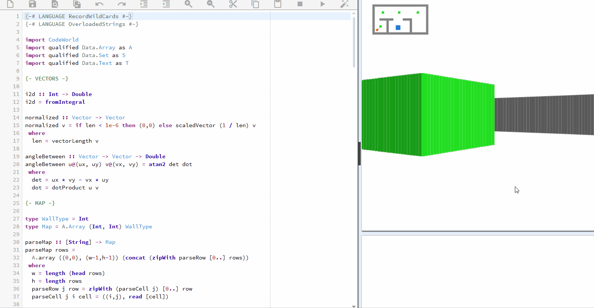

# Renderização de mapa e explicação do código
## Execução do código:



Código disponível em: https://code.world/haskell#PSAP49qms7Ahg4z1gpLm2Jw

## Funcionalidades em Haskell presentes no código

O presente código apresenta funcionalidades novas em Haskell, que necessitam de conhecimento prévio para se compreender melhor sua aplicação:

``type WallType = Int``
- Nesse caso, "WallType" seria um tipo sinônimo, renomeado para melhor leitura no código e documentação;
- Semelhante à estrutura ``typedef`` em C.

<br>

```
data State = State 
  { worldMap :: !Map 
  , playerPos :: !Vector
  , playerDir :: !Vector
  , keysPressed :: !(S.Set T.Text)
  }
```
- "data" em Haskell é utilizado para criar novos tipos de dados;
- No exemplo acima, está sendo utilizada a sintaxe de registro, pois é necessário incluir diferentes atributos ao "estado de jogo";
- Em C, a escrita seria semelhante a isso (dado que todos os tipos foram definidos anteriormente):
    ```
    typedef struct {
        Map worldMap;
        Vector playerPos;
        Vector playerDir;
        Set keysPressed;    
    } State;
    ```
<br>

```
areaCirculo :: Float -> Float
areaCirculo r = pi * raioAoQuadrado
  where
    raioAoQuadrado = r * r
```
- O "where" nesse caso é utilizado para declarar variáveis que serão utilizadas apenas no escopo da função em si;
- Em C, seria como declarar uma variável local na função:
  ```
  float areaCirculo(float r) {
    float raioAoQuadrado = r * r; // variável local
    return 3.14 * raioAoQuadrado; // pi vem de math.h
  }
  ```

## CodeWorld

Codeworld é um ambiente de desenvolvimento focado em jogos e programas que exigem uma interface gráfica mais robusta, pois permite desenhar formas, criar animações, entre outros recursos.

### Funções e dados nativos do CodeWorld

#### Picture

```
data Picture
````
- Um tipo de dado originário da biblioteca Codeworld. Capaz de mostrar um design, diagrama, formas geométricas e outros através de funções nativas, como drawingOf.

<br>

```
type Vector = (Double, Double)
```
- Gera um vetor do tipo bidimensional.

<br>

```
vectorLength :: Vector -> Double
```
- Retorna o comprimento do vetor dado através da fórmula L = √(x² + y²).
  ```
  >>> vectorLength (10, 10)
  14.14
  ```

<br>

```
scaledVector :: Double -> Vector -> Vector
```
- Multiplica os valores da coordenada do vetor a partir de algum valor.
  ```
  >>> scaledPoint 2 (10, 10)
  (20, 20)
  ```

<br>

#### Colors

```
data Color
```
- Resulta em determinada cor, através de quatro valores Double como parâmetro, sendo equivalente ao RGBA.

```
black :: Color
white :: Color
red :: Color
green :: Color
blue :: Color
```
<br>

#### Events

````
data Event
````
- Um evento iniciado pelo usuário durante a execução de um programa interativo. 
- Cada tecla pressionada envia como parâmetro uma string de um caractere contendo sua própria letra.
- Teclas que são palavras mais longas recebem caracteres especiais:

  - Up, Down, Left, and Right for the cursor keys.
  - F1, F2, etc. for function keys.
  - Backspace
  - Tab
  - Enter
  - Shift
  - Ctrl
  - Alt
  - Esc
  - PageUp
  - PageDown
  - End
  - Home
  - Insert
  - Delete
  - CapsLock
  - NumLock
  - ScrollLock
  - PrintScreen
  - Break
  - Separator
  - Cancel
  - Help
<br>

## Trechos do código

````
normalized :: Vector -> Vector
normalized v = if len < 1e-6 then (0,0) else scaledVector (1 / len) v
 where
  len = vectorLength v
````

- Recebe um vetor bidimensional e o retorna normalizado.
- Recebe o comprimento do vetor com ``vetorLengtg``. Caso seja muito pequeno, define o vetor como (0,0).
- Caso contrário, multiplica o vetor pelo valor (1/len).

<br>

````
minimapColor :: WallType -> Color
minimapColor 0 = white
minimapColor 1 = grey
minimapColor 2 = blue
minimapColor 3 = green
minimapColor _ = black
````
- Recebe um valor inteiro referente ao tipo de cor da parede, definido em ``type WallType = Int``.
- Caso o valor seja:
  - 0 = colore em branco;
  - 1 = colore em cinza;
  - 2 = colore em azul;
  - 3 = colore em verde;
  - Qualquer outro = preto.

<br>

## Referências
https://code.world/haskell#PSAP49qms7Ahg4z1gpLm2Jw <br>
https://stackoverflow.com/questions/4362328/haskell-where-vs-let <br>
https://wiki.haskell.org/index.php?title=Haskell <br>
https://haskell.tailorfontela.com.br/chapters

